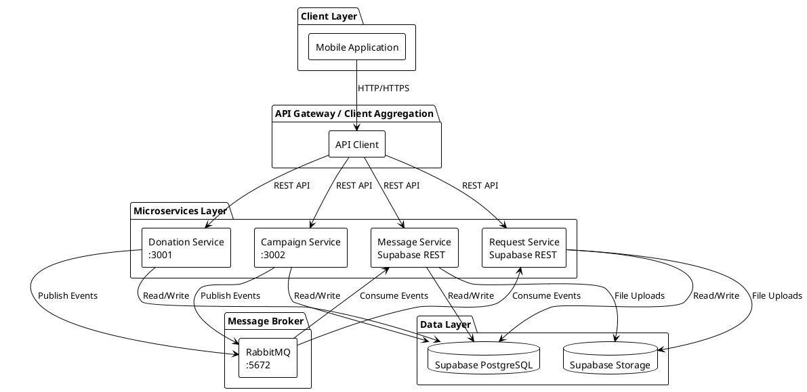
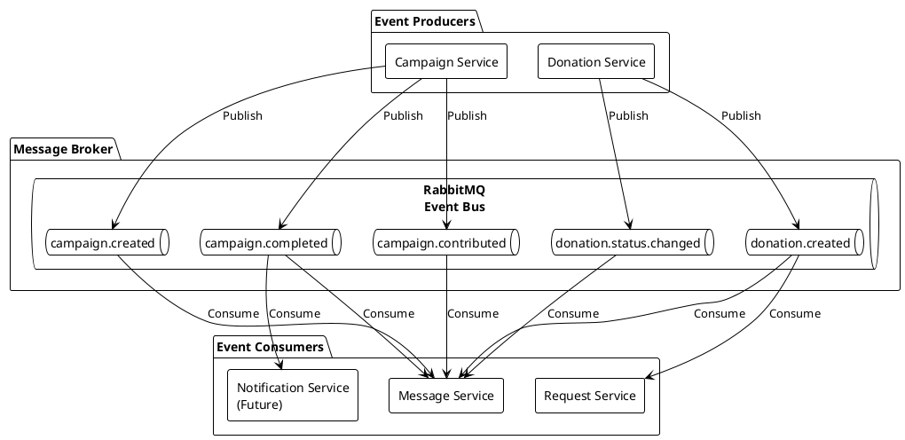
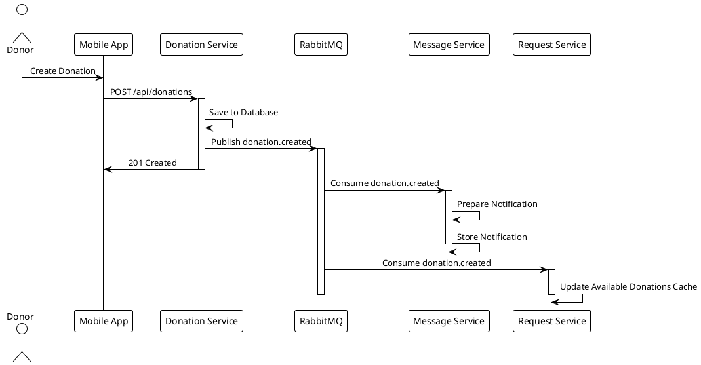
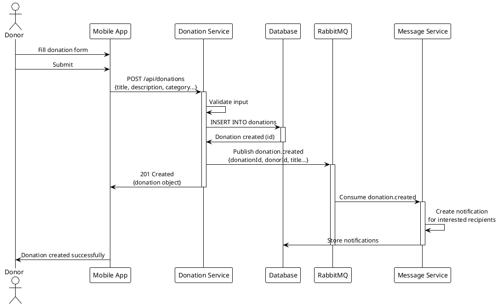
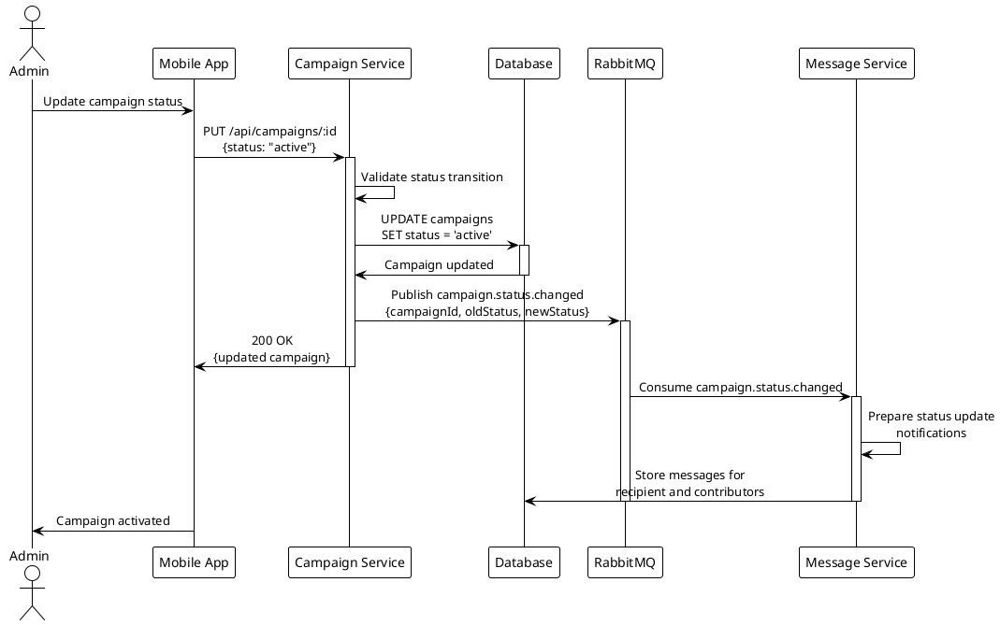
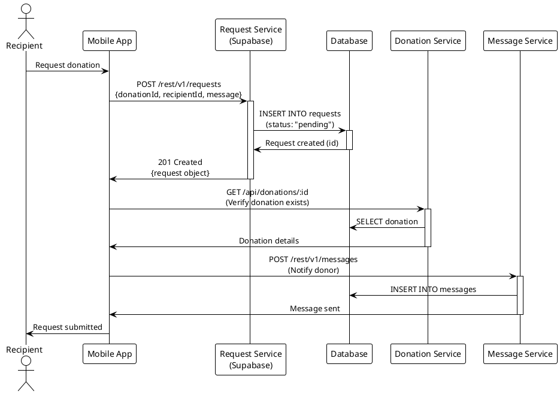
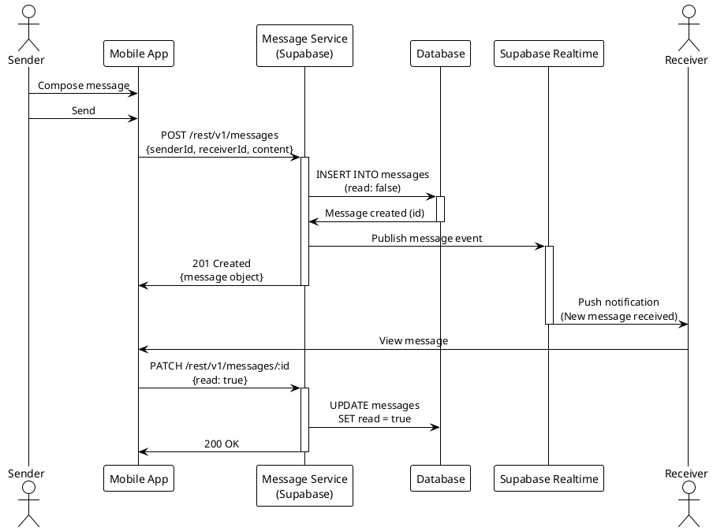
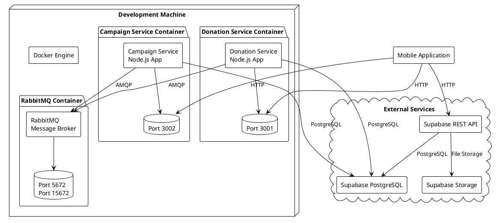

# Distributed Systems Architecture Documentation

## Donation Platform Microservices System

**Course**: SWENG5111 - Distributed Systems  
**Project**: Microservices-Based Donation Platform  
**Date**: December 2024

---

## Table of Contents

1. [Project Objectives](#1-project-objectives)
2. [System Overview](#2-system-overview)
3. [High-Level Architecture](#3-high-level-architecture)
4. [Microservice Responsibilities & APIs](#4-microservice-responsibilities--apis)
5. [Event Design](#5-event-design)
6. [Message Flow](#6-message-flow)
7. [Sequence Diagrams](#7-sequence-diagrams)
8. [Deployment Plan](#8-deployment-plan)

---

## 1. Project Objectives

### Primary Goals

The Donation Platform is designed as a distributed system that enables donors to contribute resources (items and funds) to recipients in need. The system demonstrates core distributed systems principles through a microservices architecture.

### Distributed Systems Principles

#### Scalability

- **Horizontal Scaling**: Each microservice can be independently scaled based on load. For example, the Campaign Service can be scaled separately from the Donation Service during peak fundraising periods.
- **Stateless Services**: Services maintain minimal state, allowing multiple instances to handle requests interchangeably.
- **Database Partitioning**: Each service owns its data domain, enabling independent scaling of data storage.

#### Loose Coupling

- **Service Independence**: Microservices operate independently with well-defined interfaces. Changes to one service do not require modifications to others.
- **API Contracts**: RESTful APIs provide stable contracts between services and clients.
- **Event-Driven Decoupling**: Services communicate asynchronously via events, eliminating direct dependencies.

#### Fault Tolerance

- **Service Isolation**: Failure in one service (e.g., Message Service) does not cascade to others (e.g., Donation Service continues operating).
- **Graceful Degradation**: The system continues functioning with reduced capabilities when non-critical services fail.
- **Health Monitoring**: Each service exposes health endpoints for monitoring and automated recovery.

#### Event-Driven Communication

- **Asynchronous Processing**: Long-running operations (notifications, analytics) are handled asynchronously via message queues.
- **Eventual Consistency**: Services maintain consistency over time through event propagation rather than immediate synchronization.
- **Reactive Architecture**: Services react to domain events, enabling responsive and adaptable system behavior.

---

## 2. System Overview

### Purpose

The Donation Platform connects donors with recipients through two primary mechanisms:

1. **Direct Donations**: Donors list items (books, food, clothing) that recipients can request.
2. **Campaigns**: Recipients create fundraising campaigns for monetary contributions.

### Core Components

#### Microservices

The system consists of four independent microservices:

1. **Donation Service** (Port 3001)

   - Manages donation listings and lifecycle
   - Handles donation CRUD operations
   - Publishes donation-related events

2. **Campaign Service** (Port 3002)

   - Manages fundraising campaigns
   - Processes monetary contributions
   - Tracks campaign progress and completion

3. **Message Service** (Supabase REST API)

   - Facilitates real-time messaging between users
   - Manages conversation threads
   - Handles message delivery and read status

4. **Request Service** (Supabase REST API)
   - Processes donation requests from recipients
   - Manages request approval/rejection workflow
   - Tracks request status and history

#### API Communication

- **Synchronous**: RESTful HTTP APIs for immediate request-response operations (CRUD operations, queries)
- **Asynchronous**: RabbitMQ message broker for event-driven communication (notifications, state synchronization)

#### Message Broker

**RabbitMQ** serves as the event/message broker:

- **Protocol**: AMQP (Advanced Message Queuing Protocol)
- **Pattern**: Pub/Sub (Publish-Subscribe)
- **Queues**: Durable queues ensure message persistence
- **Management**: Web UI available on port 15672

#### Database Architecture

**Supabase (PostgreSQL)** provides:

- **Shared Database Pattern**: Services access shared PostgreSQL instance with logical separation via schemas
- **Row-Level Security (RLS)**: Database-level access control ensures data isolation
- **REST API**: Supabase provides auto-generated REST endpoints for direct database access
- **Storage**: Supabase Storage handles file uploads (images, documents)

### User Interaction Flow

1. **Donor Flow**:

   - Creates donation listing → Donation Service
   - Receives request notifications → Message Service
   - Approves/rejects requests → Request Service
   - Contributes to campaigns → Campaign Service

2. **Recipient Flow**:
   - Creates fundraising campaign → Campaign Service
   - Requests donations → Request Service
   - Communicates with donors → Message Service
   - Views available donations → Donation Service

---

## 3. High-Level Architecture

### Architectural Style

The system follows a **microservices architecture** combined with **event-driven communication**:

- **Microservices**: Each service is independently deployable, scalable, and maintainable
- **Event-Driven**: Services communicate via domain events through a message broker
- **API Gateway Pattern**: Mobile application acts as a client that aggregates calls to multiple services
- **Database per Service (Logical)**: While using shared PostgreSQL, each service owns specific tables/schemas

### Communication Patterns

#### Synchronous Communication

- **REST APIs**: Direct HTTP requests for immediate responses
- **Use Cases**: CRUD operations, queries, real-time data retrieval
- **Characteristics**: Request-response, blocking, immediate consistency

#### Asynchronous Communication

- **Event Messaging**: Domain events published to RabbitMQ
- **Use Cases**: Notifications, state synchronization, analytics
- **Characteristics**: Fire-and-forget, non-blocking, eventual consistency

### High-Level Architecture Diagram



---

## 4. Microservice Responsibilities & APIs

### 4.1 Donation Service

#### Purpose and Responsibilities

The Donation Service manages the complete lifecycle of donation listings. It handles creation, retrieval, updates, and deletion of donations while maintaining data consistency and publishing domain events for other services to react.

#### Owned Data

- **donations** table:
  - `id` (UUID, Primary Key)
  - `donor_id` (UUID, Foreign Key to profiles)
  - `title`, `description`, `category`, `location`
  - `image_url` (nullable)
  - `status` (enum: pending, available, claimed, completed, rejected)
  - `created_at`, `updated_at` (timestamps)

#### Key API Endpoints

| Method   | Endpoint             | Description                                                         |
| -------- | -------------------- | ------------------------------------------------------------------- |
| `GET`    | `/health`            | Service health check and status                                     |
| `GET`    | `/api/donations`     | List donations with optional filtering (status, category, donor_id) |
| `GET`    | `/api/donations/:id` | Retrieve a specific donation by UUID                                |
| `POST`   | `/api/donations`     | Create a new donation listing                                       |
| `PUT`    | `/api/donations/:id` | Update donation details or status                                   |
| `DELETE` | `/api/donations/:id` | Delete a donation                                                   |
| `GET`    | `/api-docs`          | Swagger/OpenAPI documentation                                       |

**Request Example (Create Donation)**:

```json
POST /api/donations
{
  "donor_id": "550e8400-e29b-41d4-a716-446655440000",
  "title": "Books for Education",
  "description": "Educational books for children",
  "category": "Books",
  "location": "Addis Ababa, Ethiopia",
  "image_url": "https://storage.example.com/image.jpg",
  "status": "pending"
}
```

**Response Example**:

```json
{
  "id": "660e8400-e29b-41d4-a716-446655440001",
  "donor_id": "550e8400-e29b-41d4-a716-446655440000",
  "title": "Books for Education",
  "description": "Educational books for children",
  "category": "Books",
  "location": "Addis Ababa, Ethiopia",
  "image_url": "https://storage.example.com/image.jpg",
  "status": "pending",
  "created_at": "2024-12-19T10:00:00Z",
  "updated_at": "2024-12-19T10:00:00Z"
}
```

---

### 4.2 Campaign Service

#### Purpose and Responsibilities

The Campaign Service manages fundraising campaigns, including creation, updates, monetary contributions, and progress tracking. It ensures campaign goal calculations and publishes events when campaigns reach completion.

#### Owned Data

- **campaigns** table:
  - `id` (UUID, Primary Key)
  - `recipient_id` (UUID, Foreign Key to profiles)
  - `title`, `description`, `category`, `location`
  - `goal_amount` (decimal, nullable)
  - `collected_amount` (decimal, nullable, default: 0)
  - `image_url` (nullable)
  - `status` (enum: pending, active, paused, completed, rejected)
  - `created_at`, `updated_at` (timestamps)

#### Key API Endpoints

| Method   | Endpoint                        | Description                                                             |
| -------- | ------------------------------- | ----------------------------------------------------------------------- |
| `GET`    | `/health`                       | Service health check and status                                         |
| `GET`    | `/api/campaigns`                | List campaigns with optional filtering (status, category, recipient_id) |
| `GET`    | `/api/campaigns/:id`            | Retrieve a specific campaign by UUID                                    |
| `POST`   | `/api/campaigns`                | Create a new fundraising campaign                                       |
| `PUT`    | `/api/campaigns/:id`            | Update campaign details or status                                       |
| `POST`   | `/api/campaigns/:id/contribute` | Add monetary contribution to a campaign                                 |
| `DELETE` | `/api/campaigns/:id`            | Delete a campaign                                                       |
| `GET`    | `/api-docs`                     | Swagger/OpenAPI documentation                                           |

**Request Example (Contribute to Campaign)**:

```json
POST /api/campaigns/550e8400-e29b-41d4-a716-446655440000/contribute
{
  "amount": 100.50
}
```

**Response Example**:

```json
{
  "id": "550e8400-e29b-41d4-a716-446655440000",
  "recipient_id": "770e8400-e29b-41d4-a716-446655440002",
  "title": "Medical Fund",
  "description": "Help with medical expenses",
  "category": "Medical",
  "location": "Addis Ababa, Ethiopia",
  "goal_amount": 5000.0,
  "collected_amount": 2100.5,
  "status": "active",
  "created_at": "2024-12-19T10:00:00Z",
  "updated_at": "2024-12-19T11:30:00Z"
}
```

---

### 4.3 Message Service

#### Purpose and Responsibilities

The Message Service facilitates real-time communication between users (donors and recipients). It manages message threads, delivery status, and read receipts. While implemented via Supabase REST API, it functions as an independent service domain.

#### Owned Data

- **messages** table:
  - `id` (UUID, Primary Key)
  - `campaign_id` (UUID, nullable, Foreign Key to campaigns)
  - `donation_id` (UUID, nullable, Foreign Key to donations)
  - `sender_id` (UUID, Foreign Key to profiles)
  - `receiver_id` (UUID, Foreign Key to profiles)
  - `content` (text)
  - `read` (boolean, default: false)
  - `created_at` (timestamp)

#### Key API Endpoints

| Method  | Endpoint                | Description                                                                              |
| ------- | ----------------------- | ---------------------------------------------------------------------------------------- |
| `GET`   | `/rest/v1/messages`     | List messages with optional filtering (campaign_id, donation_id, sender_id, receiver_id) |
| `GET`   | `/rest/v1/messages/:id` | Retrieve a specific message by UUID                                                      |
| `POST`  | `/rest/v1/messages`     | Create and send a new message                                                            |
| `PATCH` | `/rest/v1/messages/:id` | Update message (typically to mark as read)                                               |

**Request Example (Send Message)**:

```json
POST /rest/v1/messages
Headers: {
  "Authorization": "Bearer SUPABASE_ANON_KEY",
  "Content-Type": "application/json"
}
{
  "campaign_id": "550e8400-e29b-41d4-a716-446655440000",
  "sender_id": "660e8400-e29b-41d4-a716-446655440001",
  "receiver_id": "770e8400-e29b-41d4-a716-446655440002",
  "content": "Hello, I'm interested in contributing to your campaign."
}
```

---

### 4.4 Request Service

#### Purpose and Responsibilities

The Request Service manages donation requests from recipients to donors. It handles the request lifecycle (pending → approved/rejected) and coordinates with the Donation Service for status updates.

#### Owned Data

- **requests** table:
  - `id` (UUID, Primary Key)
  - `donation_id` (UUID, Foreign Key to donations)
  - `recipient_id` (UUID, Foreign Key to profiles)
  - `message` (text)
  - `status` (enum: pending, approved, rejected)
  - `created_at`, `updated_at` (timestamps)

#### Key API Endpoints

| Method   | Endpoint                | Description                                                               |
| -------- | ----------------------- | ------------------------------------------------------------------------- |
| `GET`    | `/rest/v1/requests`     | List requests with optional filtering (donation_id, recipient_id, status) |
| `GET`    | `/rest/v1/requests/:id` | Retrieve a specific request by UUID                                       |
| `POST`   | `/rest/v1/requests`     | Create a new donation request                                             |
| `PATCH`  | `/rest/v1/requests/:id` | Update request status (approve/reject)                                    |
| `DELETE` | `/rest/v1/requests/:id` | Delete a request                                                          |

**Request Example (Create Request)**:

```json
POST /rest/v1/requests
Headers: {
  "Authorization": "Bearer SUPABASE_ANON_KEY",
  "Content-Type": "application/json"
}
{
  "donation_id": "550e8400-e29b-41d4-a716-446655440000",
  "recipient_id": "770e8400-e29b-41d4-a716-446655440002",
  "message": "I would like to request this donation for my family."
}
```

---

## 5. Event Design

### Domain Events

Domain events represent significant business occurrences that other services may need to react to. Events are published to RabbitMQ queues and consumed asynchronously.

### Event Catalog

#### Donation Domain Events

| Event Name                | Producer         | Consumers                        | Payload Summary                                    |
| ------------------------- | ---------------- | -------------------------------- | -------------------------------------------------- |
| `donation.created`        | Donation Service | Message Service, Request Service | `{ donationId, donorId, title, category, status }` |
| `donation.status.changed` | Donation Service | Message Service, Request Service | `{ donationId, oldStatus, newStatus, timestamp }`  |
| `donation.claimed`        | Donation Service | Message Service, Request Service | `{ donationId, recipientId, claimedAt }`           |
| `donation.deleted`        | Donation Service | Message Service, Request Service | `{ donationId, deletedAt }`                        |

#### Campaign Domain Events

| Event Name                | Producer         | Consumers       | Payload Summary                                         |
| ------------------------- | ---------------- | --------------- | ------------------------------------------------------- |
| `campaign.created`        | Campaign Service | Message Service | `{ campaignId, recipientId, title, goalAmount }`        |
| `campaign.status.changed` | Campaign Service | Message Service | `{ campaignId, oldStatus, newStatus, timestamp }`       |
| `campaign.contributed`    | Campaign Service | Message Service | `{ campaignId, contributorId, amount, newTotal }`       |
| `campaign.completed`      | Campaign Service | Message Service | `{ campaignId, recipientId, finalAmount, completedAt }` |
| `campaign.deleted`        | Campaign Service | Message Service | `{ campaignId, deletedAt }`                             |

### Event Payload Examples

**donation.created**:

```json
{
  "eventType": "donation.created",
  "eventId": "evt-123e4567-e89b-12d3-a456-426614174000",
  "timestamp": "2024-12-19T10:00:00Z",
  "payload": {
    "donationId": "550e8400-e29b-41d4-a716-446655440000",
    "donorId": "660e8400-e29b-41d4-a716-446655440001",
    "title": "Books for Education",
    "category": "Books",
    "status": "pending"
  }
}
```

**campaign.contributed**:

```json
{
  "eventType": "campaign.contributed",
  "eventId": "evt-223e4567-e89b-12d3-a456-426614174001",
  "timestamp": "2024-12-19T11:30:00Z",
  "payload": {
    "campaignId": "770e8400-e29b-41d4-a716-446655440002",
    "contributorId": "660e8400-e29b-41d4-a716-446655440001",
    "amount": 100.5,
    "newTotal": 2100.5,
    "goalAmount": 5000.0
  }
}
```

### Design Notes

#### Idempotency

Events are designed to be idempotent. Consumers should check for duplicate processing using:

- **Event ID**: Unique identifier for each event
- **Timestamp**: Event creation timestamp
- **Idempotency Keys**: Service-specific keys stored in consumer databases

**Example**: Message Service stores processed event IDs to prevent duplicate notifications.

#### Event Versioning

Events include version information to support schema evolution:

- **Current Version**: v1.0
- **Versioning Strategy**: Semantic versioning (major.minor.patch)
- **Backward Compatibility**: New fields are optional; consumers ignore unknown fields

#### Eventual Consistency

The system embraces eventual consistency:

- **Immediate Consistency**: Within service boundaries (e.g., donation creation in Donation Service)
- **Eventual Consistency**: Across services (e.g., notification delivery may be delayed)
- **Consistency Windows**: Typically < 1 second for event propagation
- **Conflict Resolution**: Last-write-wins for status updates; business rules prevent conflicts

### Event-Driven Architecture Diagram



---

## 6. Message Flow

### Event Flow Overview

When a domain event occurs, the following flow ensures proper propagation and processing:

1. **Event Generation**: Service performs business operation and generates domain event
2. **Event Publishing**: Event is published to RabbitMQ queue
3. **Event Routing**: RabbitMQ routes event to subscribed consumers
4. **Event Consumption**: Consumer services process events asynchronously
5. **Side Effects**: Consumers perform their operations (notifications, state updates)

### Service Independence

Services react independently to events:

- **No Direct Dependencies**: Services do not call each other directly for event processing
- **Loose Coupling**: Services only depend on event schemas, not service implementations
- **Failure Isolation**: If Message Service fails, Donation Service continues operating

### Message Flow Diagram



---

## 7. Sequence Diagrams

### 7.1 Donation Creation Sequence

#### Explanation

When a donor creates a donation listing:

1. Mobile app sends request to Donation Service
2. Service validates input and persists donation
3. Service publishes `donation.created` event
4. Message Service consumes event and prepares notifications
5. Request Service updates its cache of available donations

#### Sequence Diagram



### 7.2 Campaign Update Sequence

#### Explanation

When a campaign status is updated (e.g., from pending to active):

1. Admin or system updates campaign via Campaign Service
2. Service validates and updates database
3. Service publishes `campaign.status.changed` event
4. Message Service notifies campaign creator and contributors
5. System may trigger additional workflows based on status

#### Sequence Diagram



### 7.3 Request Submission Sequence

#### Explanation

When a recipient requests a donation:

1. Recipient submits request via Request Service (Supabase REST API)
2. Request is stored with status "pending"
3. Donation Service is notified (via event or direct API call)
4. Donor receives notification through Message Service
5. Donor can approve/reject via Request Service update

#### Sequence Diagram



### 7.4 Message/Notification Sending Sequence

#### Explanation

When a message is sent between users:

1. User sends message via Message Service
2. Message is stored in database
3. If related to campaign/donation, relevant services may be notified
4. Recipient receives real-time notification (via Supabase Realtime)
5. Read status is updated when recipient views message

#### Sequence Diagram



---

## 8. Deployment Plan

### Deployment Strategy

The system uses **Docker containerization** with **Docker Compose** for orchestration. Each microservice runs in its own container, ensuring isolation, portability, and consistent environments.

### Container Architecture

#### One Container per Service

- **Donation Service Container**: Node.js application on port 3001
- **Campaign Service Container**: Node.js application on port 3002
- **Message Service**: Handled via Supabase REST API (no separate container)
- **Request Service**: Handled via Supabase REST API (no separate container)
- **RabbitMQ Container**: Message broker on ports 5672 (AMQP) and 15672 (Management UI)

#### Database Strategy

- **External Database**: Supabase PostgreSQL (hosted, not containerized for production)
- **Development**: Can use local PostgreSQL container if needed
- **Storage**: Supabase Storage (external, not containerized)

### Service Communication in Deployment

#### Container Networking

- **Docker Networks**: Each service uses isolated Docker networks
- **Service Discovery**: Services reference each other by container name (e.g., `rabbitmq:5672`)
- **Port Mapping**: Host ports mapped to container ports for external access

#### Communication Patterns

1. **Inter-Service REST**: Services call each other using container names (e.g., `http://donation-service:3001`)
2. **RabbitMQ**: Services connect to RabbitMQ using `amqp://rabbitmq:5672`
3. **Database**: Services connect to Supabase using external URLs (environment variables)
4. **Client Access**: Mobile app accesses services via host machine IP addresses

### Docker Compose Configuration

Each service has its own `docker-compose.yml`:

**Donation Service**:

```yaml
services:
  donation-service:
    build: .
    ports:
      - "3001:3001"
    environment:
      - RABBITMQ_URL=amqp://rabbitmq:5672
      - SUPABASE_URL=${SUPABASE_URL}
    networks:
      - donation-network
```

**Campaign Service**:

```yaml
services:
  campaign-service:
    build: .
    ports:
      - "3002:3002"
    environment:
      - RABBITMQ_URL=amqp://rabbitmq:5672
      - SUPABASE_URL=${SUPABASE_URL}
    networks:
      - campaign-network
```

### Deployment Diagram



### Deployment Steps

1. **Build Images**:

   ```bash
   cd microservices/donation-service
   docker build -t donation-service:latest .

   cd microservices/campaign-service
   docker build -t campaign-service:latest .
   ```

2. **Start RabbitMQ**:

   ```bash
   docker run -d --name rabbitmq \
     -p 5672:5672 -p 15672:15672 \
     rabbitmq:3-management
   ```

3. **Start Services**:

   ```bash
   cd microservices/donation-service
   docker-compose up -d

   cd microservices/campaign-service
   docker-compose up -d
   ```

4. **Verify Deployment**:
   ```bash
   docker ps
   curl http://localhost:3001/health
   curl http://localhost:3002/health
   ```

### Environment Configuration

Each service requires environment variables:

- `SUPABASE_URL`: Supabase project URL
- `SUPABASE_KEY`: Supabase anon key
- `RABBITMQ_URL`: RabbitMQ connection string
- `PORT`: Service port (3001 or 3002)
- `NODE_ENV`: Environment (development/production)

### Scaling Considerations

- **Horizontal Scaling**: Multiple instances of each service can run behind a load balancer
- **Stateless Design**: Services are stateless, enabling easy scaling
- **Database Connection Pooling**: Each service manages its own database connection pool
- **Message Queue Scaling**: RabbitMQ supports clustering for high availability

---

## Conclusion

This distributed system demonstrates key microservices principles through:

- **Service Isolation**: Independent deployment and scaling
- **Event-Driven Architecture**: Loose coupling via asynchronous messaging
- **API-First Design**: RESTful interfaces for synchronous communication
- **Containerization**: Docker-based deployment for consistency and portability

The architecture supports scalability, fault tolerance, and maintainability while providing a foundation for future enhancements and service additions.

---

**Document Version**: 1.0  
**Last Updated**: December 19, 2024  
**Author**: Distributed Systems Project Team
