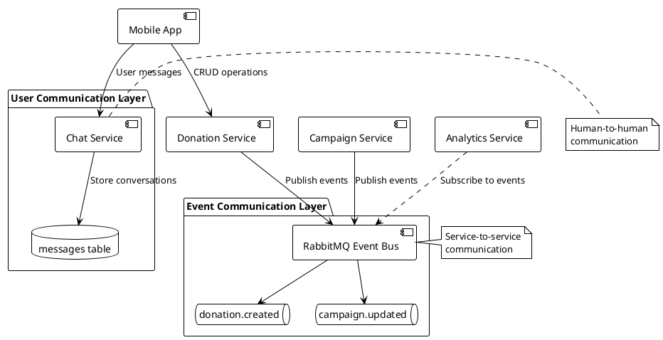

# Deep Analysis: Message Service vs RabbitMQ

## Executive Summary

**Your concern is valid.** The current architecture has a conceptual confusion between:

- **Message Service** (user-to-user messaging, like WhatsApp)
- **RabbitMQ** (service-to-service event messaging)

They serve **completely different purposes** and both are necessary, but the naming creates confusion.

---

## 🎯 Core Business Requirements Analysis

### What the Business Actually Needs

1. **User Communication** (Currently called "Message Service")
   - Donors and recipients need to chat about donations
   - Campaign creators need to communicate with contributors
   - Real-time messaging with read receipts
   - Message history and conversation threads
2. **System Events** (RabbitMQ)
   - When donation is created → notify interested recipients
   - When campaign gets contribution → update analytics
   - When request is approved → trigger status changes
   - Service-to-service communication without direct coupling

---

## 🔍 Current Architecture Analysis

### What "Message Service" Actually Is

Looking at the codebase:

```typescript
// From types/database.ts
messages: {
  Row: {
    id: string;
    campaign_id: string | null;
    donation_id: string | null;
    sender_id: string; // Human user
    receiver_id: string; // Human user
    content: string; // Chat message
    read: boolean; // Read receipt
    created_at: string;
  }
}
```

**This is NOT a message broker service!** This is a **Chat/Conversation Service** that:

- Stores human-to-human conversations
- Links messages to donations/campaigns
- Tracks read status
- Provides chat history

### What RabbitMQ Actually Does

```javascript
// From microservices/donation-service
publishEvent("donation.created", {
  donationId: donation.id,
  donorId: donation.donor_id,
  title: donation.title,
  category: donation.category,
});
```

RabbitMQ handles:

- Service-to-service events
- Asynchronous processing
- Event-driven architecture
- System notifications

---

## ❌ The Naming Problem

The confusion comes from poor naming:

| Current Name      | What It Actually Is | Better Name                                  |
| ----------------- | ------------------- | -------------------------------------------- |
| Message Service   | User chat system    | **Chat Service** or **Conversation Service** |
| RabbitMQ messages | System events       | **Domain Events**                            |

---

## ✅ Why You Need Both

### 1. Chat/Conversation Service (Currently "Message Service")

**Purpose**: Enable human communication

**Use Cases**:

- "Is this book still available?"
- "Can you deliver to my location?"
- "Thank you for your donation!"
- "I've contributed $50 to your campaign"

**Implementation**:

- Database table (`messages`)
- REST API via Supabase
- Real-time updates via Supabase Realtime
- Mobile app UI for chat

### 2. RabbitMQ (Event Broker)

**Purpose**: Decouple services and enable event-driven architecture

**Use Cases**:

- When donation created → Multiple services need to know
- When campaign completed → Trigger completion workflows
- When user reported → Start review process
- Analytics, notifications, cache updates

**Implementation**:

- AMQP protocol
- Pub/Sub pattern
- Fire-and-forget messaging
- No human interaction

---

## 🏗️ Recommended Architecture Clarification

### Rename for Clarity

```yaml
Current (Confusing):
  - Message Service → handles user chats
  - RabbitMQ → handles "messages" between services

Recommended (Clear):
  - Chat Service → handles user conversations
  - Event Bus (RabbitMQ) → handles domain events
```

### Clear Separation of Concerns



---

## 📊 Comparison Table

| Aspect        | Chat Service ("Message Service") | RabbitMQ (Event Bus)                       |
| ------------- | -------------------------------- | ------------------------------------------ |
| **Purpose**   | Human communication              | Service orchestration                      |
| **Users**     | Donors & Recipients              | Microservices                              |
| **Content**   | Text messages, questions         | Domain events, state changes               |
| **Storage**   | Permanent (database)             | Temporary (queue)                          |
| **Delivery**  | Direct person-to-person          | Pub/Sub broadcast                          |
| **Examples**  | "Is this available?"             | `{event: "donation.created", data: {...}}` |
| **UI**        | Chat interface in app            | No UI (backend only)                       |
| **Protocol**  | HTTP/REST                        | AMQP                                       |
| **Real-time** | Yes (Supabase Realtime)          | Yes (event streaming)                      |

---

## 🎯 Business Value of Each

### Chat Service Value

1. **Builds Trust**: Users can communicate before transactions
2. **Reduces Fraud**: Verification through conversation
3. **Improves UX**: Questions answered quickly
4. **Enables Negotiation**: Delivery arrangements, pickup times

### RabbitMQ Value

1. **System Resilience**: Services fail independently
2. **Scalability**: Add new services without changing existing ones
3. **Maintainability**: Services remain loosely coupled
4. **Performance**: Async processing doesn't block user actions

---

## 💡 Recommendations

### 1. Immediate Actions

- **Document the distinction** clearly in README
- **Rename in documentation** (keep code as-is for now):
  - "Message Service" → "Chat Service" in docs
  - "RabbitMQ messages" → "Domain Events" in docs

### 2. Future Improvements

- Consider extracting Chat Service into its own microservice (currently in Supabase)
- Add event sourcing for audit trail
- Implement notification service as separate microservice

### 3. For Your Academic Project

When presenting, emphasize:

- **Two different communication patterns** for different needs
- **Separation of concerns** between user and system communication
- **Event-driven architecture** benefits via RabbitMQ
- **Real-time user experience** via Chat Service

---

## 🔑 Key Takeaway

**You're right to question this!** The naming is confusing, but both components are essential:

1. **Chat Service** (misnamed "Message Service"): For humans to talk to each other
2. **RabbitMQ**: For services to communicate without coupling

Think of it like a company:

- **Chat Service** = Slack (employees talking)
- **RabbitMQ** = Internal memos/announcements (departments coordinating)

Both are "messaging" but serve completely different purposes. The architecture is correct; the naming is just unfortunate.

---

## Example to Illustrate

When a donation is created:

1. **RabbitMQ Event**:

   ```json
   {
     "event": "donation.created",
     "donationId": "123",
     "donorId": "456"
   }
   ```

   → Analytics service updates stats
   → Notification service alerts recipients
   → Cache service updates listings

2. **Chat Service Message** (later, when recipient is interested):
   ```json
   {
     "sender_id": "789", // Recipient
     "receiver_id": "456", // Donor
     "content": "Hi! Is the laptop still available?",
     "donation_id": "123"
   }
   ```
   → Stored in database
   → Shown in app chat UI
   → Real human reads and responds

**Different systems, different purposes, both needed!**


